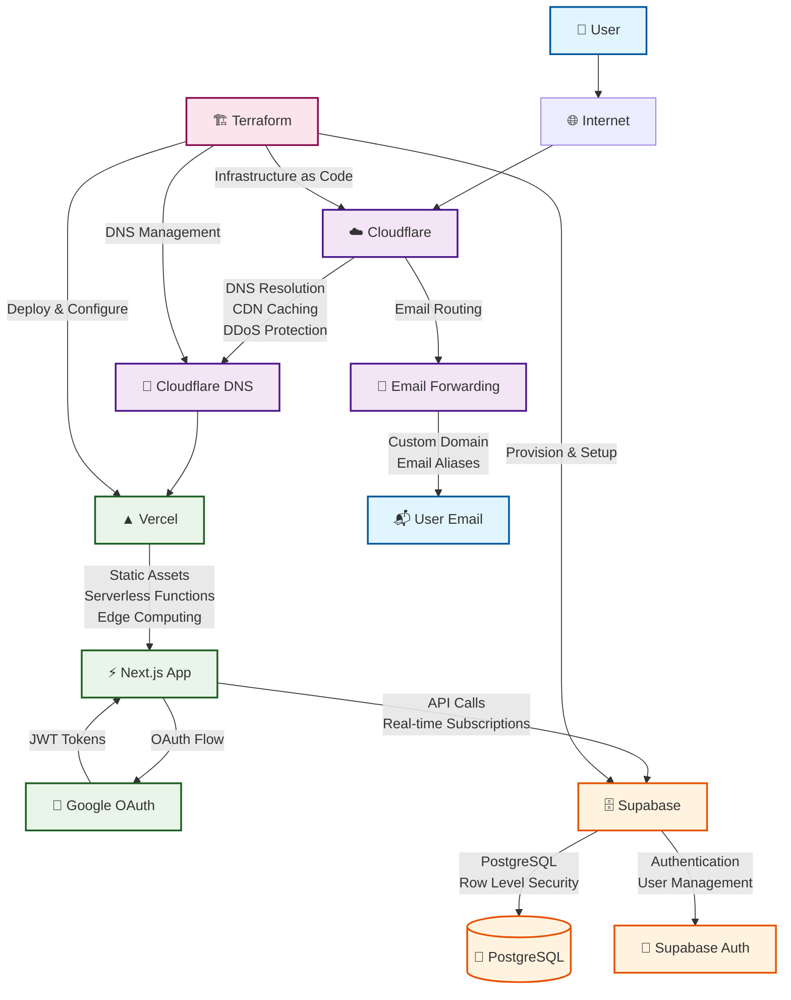

# 🏗️ Personal Project Template Architecture

## High-Level System Architecture

This diagram shows the complete flow from user requests through Cloudflare to the application stack.



## Component Details

### 🌐 **Cloudflare Layer**
- **DNS Management**: Custom domain resolution
- **CDN**: Global content delivery and caching
- **DDoS Protection**: Security and performance optimization
- **Email Routing**: Custom domain email forwarding

### ⚡ **Vercel Application Layer**
- **Next.js App**: React-based full-stack application
- **Serverless Functions**: API routes and server-side logic
- **Edge Computing**: Global deployment and optimization
- **Static Assets**: Optimized delivery of CSS, JS, and images

### 🔐 **Authentication Layer**
- **Google OAuth**: Social login integration
- **Supabase Auth**: User management and session handling
- **JWT Tokens**: Secure authentication tokens
- **Row Level Security**: Database-level access control

### 🗄️ **Database Layer**
- **PostgreSQL**: Primary database with full SQL support
- **Real-time Subscriptions**: Live data updates
- **Migrations**: Version-controlled schema changes
- **Seeding**: Initial data population

### 🏗️ **Infrastructure Management**
- **Terraform**: Infrastructure as Code
- **Modular Design**: Reusable components
- **Environment Management**: Staging and production configs
- **Automated Deployment**: CI/CD integration

## Data Flow

### 1. **User Request Flow**
```
User → Cloudflare → Vercel → Next.js App
```

### 2. **Authentication Flow**
```
User → Google OAuth → Supabase Auth → JWT Token → App Session
```

### 3. **Database Operations**
```
App → Supabase API → PostgreSQL → Real-time Updates → App
```

### 4. **Infrastructure Deployment**
```
Terraform → Cloudflare/Vercel/Supabase → Live Infrastructure
```

## Security Features

- **🔒 HTTPS Everywhere**: SSL/TLS encryption
- **🛡️ DDoS Protection**: Cloudflare security
- **🔐 OAuth Integration**: Secure social login
- **🔑 JWT Tokens**: Stateless authentication
- **🛡️ Row Level Security**: Database access control
- **🔍 Secret Detection**: Pre-commit security scanning

## Performance Features

- **⚡ Edge Computing**: Global CDN distribution
- **🚀 Serverless Functions**: Auto-scaling backend
- **💾 Database Optimization**: Connection pooling
- **📦 Asset Optimization**: Automatic compression
- **🔄 Real-time Updates**: Live data synchronization

## Development Workflow

### **Local Development**
```bash
npm run dev          # Start Next.js development server
npm run db:reset     # Reset Supabase database
npm run db:seed      # Seed with sample data
```

### **Code Quality**
```bash
npm run pre-commit-full  # Run all quality checks
npm run lint            # ESLint checking
npm run type-check      # TypeScript validation
npm run format          # Code formatting
```

### **Infrastructure**
```bash
terraform init        # Initialize Terraform
terraform plan        # Preview changes
terraform apply       # Deploy infrastructure
```

## Monitoring & Observability

- **📊 Vercel Analytics**: Performance monitoring
- **🔍 Cloudflare Analytics**: Traffic and security insights
- **📈 Supabase Dashboard**: Database and auth metrics
- **🚨 Error Tracking**: Built-in error monitoring
- **📋 Logs**: Centralized logging across services

## Scalability Considerations

- **🔄 Auto-scaling**: Serverless functions scale automatically
- **🌍 Global Distribution**: Edge computing for low latency
- **💾 Database Scaling**: Supabase handles scaling automatically
- **📦 CDN Caching**: Reduced origin server load
- **🔧 Infrastructure as Code**: Easy environment replication

---

*This architecture provides a robust, scalable foundation for personal projects with enterprise-grade security and performance.*
