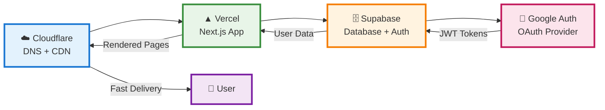

# 🔄 Core Component Flow

## Simplified Architecture Flow

This diagram shows the essential flow: **Cloudflare → Vercel → Supabase → Google Auth**



## Component Responsibilities

### ☁️ **Cloudflare**
- **DNS Resolution**: Routes traffic to Vercel
- **CDN Caching**: Accelerates content delivery
- **DDoS Protection**: Shields from attacks
- **SSL/TLS**: Encrypts all traffic

### ▲ **Vercel**
- **Next.js Hosting**: Serves the React application
- **Serverless Functions**: Handles API requests
- **Edge Computing**: Global performance optimization
- **Automatic Deployments**: CI/CD from Git

### 🗄️ **Supabase**
- **PostgreSQL Database**: Stores application data
- **Authentication Service**: Manages user sessions
- **Real-time Subscriptions**: Live data updates
- **Row Level Security**: Database access control

### 🔐 **Google Auth**
- **OAuth Provider**: Handles social login
- **User Identity**: Provides user profile data
- **JWT Tokens**: Secure authentication tokens
- **Social Integration**: Seamless user experience

## Request Flow Example

### 1. **User Visits Site**
```
User → Cloudflare (DNS lookup) → Vercel (app serving)
```

### 2. **User Logs In**
```
User → Vercel → Supabase Auth → Google OAuth → JWT Token → Session
```

### 3. **User Interacts with App**
```
User → Vercel → Supabase API → PostgreSQL → Real-time Updates
```

### 4. **Data Persistence**
```
App Changes → Supabase → PostgreSQL → Real-time Sync → All Clients
```

## Key Benefits

- **🚀 Performance**: Global CDN + Edge computing
- **🔒 Security**: Multi-layer authentication + encryption
- **📈 Scalability**: Serverless + managed database
- **🛠️ Developer Experience**: Modern stack + great tooling
- **💰 Cost Effective**: Pay-as-you-scale pricing

---

*This simplified flow shows how each component works together to create a robust, scalable application stack.*
